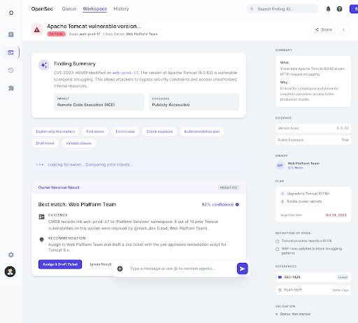
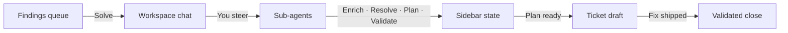

<!--
  README visual asset checklist — see also docs/README-assets-todo.md
  [ ] Logo / wordmark at docs/assets/brand/opensec-logo.svg (light) + -dark.svg — 240×64
  [ ] Social/OG card at docs/assets/brand/og-card.png — 1280×640
  [ ] Real hero screenshot at docs/assets/screenshots/hero-workspace.png
       (currently using frontend/mockups/screenshots/workspace.png as placeholder)
  [ ] Hero demo GIF at docs/assets/screenshots/hero-demo.gif — 30–60s workspace walkthrough
  [ ] "Earn the Badge" preview SVG at docs/assets/brand/badge-preview.svg
  [ ] Live demo URL at demo.opensec.dev (remove "(coming soon)" when live)
-->

<div align="center">


# OpenSec

**Your security team, in chat.**

Self-hosted, open-source AI copilot for vulnerability remediation — built for OSS maintainers who want their repo to earn the badge.

[](LICENSE)
[](#status--roadmap)
[](https://github.com/galanko/OpenSec/actions/workflows/backend.yml)
[](https://github.com/galanko/OpenSec/actions/workflows/frontend.yml)
[](https://github.com/anomalyco/opencode)
[](https://github.com/galanko/OpenSec/discussions)
[](https://github.com/galanko/OpenSec/stargazers)

[Quick start](#quick-start) · [How it works](#how-it-works) · [Earn the badge](#earn-the-badge) · [Docs](docs/architecture/overview.md) · [Roadmap](ROADMAP.md)

</div>

> **⚠️ OpenSec is in alpha.** Single-user community edition, currently in **Stage 3** of the roadmap (agent orchestration + ticketing). Expect rough edges, breaking changes, and missing adapters. Issues and PRs welcome — see [ROADMAP.md](ROADMAP.md).

<p align="center">
  
</p>

---

## What is OpenSec?

OpenSec is a self-hosted, chat-led cybersecurity remediation copilot — think **Claude Code, but for the security team**.

You drop in a vulnerability finding (from Snyk, Trivy, a CSV, or your own scanner) and OpenSec gives you a workspace where AI sub-agents enrich context, identify owners, build a fix plan, draft tickets, and confirm closure. You steer from a single chat. The product keeps structured state — summary, evidence, owner, plan, definition of done, ticket, validation — so nothing gets lost.

Built on the [OpenCode](https://github.com/anomalyco/opencode) engine. AGPL-3.0 licensed. Runs in a single Docker container.

---

## Sources × Actions

OpenSec is built around two axes. **Pull findings from anywhere. Take every action a security engineer would.**

<table>
<tr>
<th>Finding sources</th>
<th>Remediation actions</th>
</tr>
<tr>
<td valign="top">

- [x] CSV / JSON / Markdown imports
- [x] Demo fixture adapter
- [ ] Snyk
- [ ] Trivy
- [ ] GitHub Advanced Security
- [ ] Custom sources via `FindingSource` interface

</td>
<td valign="top">

- [x] **Enrich** — CVE details, severity, exploit maturity
- [x] **Resolve owner** — team/person with evidence
- [x] **Analyze exposure** — reachability, environment, blast radius
- [x] **Plan the fix** — steps, mitigations, definition of done
- [ ] **Draft the ticket** — Jira / GitHub issue with full context
- [x] **Validate** — confirm closure, recommend close or reopen

</td>
</tr>
</table>

Every action flows through chat and persists into structured sidebar state. Nothing lives only as chat text.

---

## Demo

Live hosted demo coming soon at `demo.opensec.dev`. Until then, spin it up locally in under two minutes — see [Quick start](#quick-start).

---

## Quick start

> **Prerequisites: Docker 24+ and an LLM API key** (Anthropic or OpenAI).
> Tested on Linux (Ubuntu 24.04) and macOS Docker Desktop. Windows users:
> run from inside WSL2.

### One-line install

<!-- install:start -->
```bash
curl -fsSL https://github.com/galanko/OpenSec/releases/latest/download/install.sh | sh
```
<!-- install:end -->

The installer drops a `docker-compose.yml` and `.env` in `~/opensec`,
generates a credential vault key, prompts for your API key, and waits
for `/health` to come up. It also installs the `opensec` agent CLI to
`~/.local/bin` and the `/secure-repo` Claude Code skill to
`~/.claude/skills/`. Re-run any time to upgrade.

When the installer prints the URL, open
[http://localhost:8000](http://localhost:8000) and OpenSec is ready.

### Manual install

If you'd rather not pipe a script:

```bash
docker run --rm -p 8000:8000 \
  -e ANTHROPIC_API_KEY=sk-ant-... \
  -v opensec-data:/data \
  ghcr.io/galanko/opensec:latest
```

For Compose, digest pinning, host bind-mounts, platform-specific notes,
and upgrade paths, see [docs/install.md](docs/install.md).

### Supported LLM providers

| Provider  | Env var              | Example value         |
|-----------|----------------------|-----------------------|
| Anthropic | `ANTHROPIC_API_KEY`  | `sk-ant-...`          |
| OpenAI    | `OPENAI_API_KEY`     | `sk-...`              |

Set exactly one. Both can be set at the same time, but only one will be
used per workspace based on the model selected in Settings.

### Verifying the image

The image is signed via Sigstore keyless OIDC and ships with SLSA build
provenance and a CycloneDX SBOM. Verify before you run in production:

```bash
DIGEST=sha256:...   # from the release page

cosign verify ghcr.io/galanko/opensec@${DIGEST} \
  --certificate-identity-regexp 'https://github\.com/galanko/OpenSec/\.github/workflows/release\.yml@.*' \
  --certificate-oidc-issuer https://token.actions.githubusercontent.com

gh attestation verify oci://ghcr.io/galanko/opensec@${DIGEST} --owner galanko
```

Full instructions: [docs/verify-release.md](docs/verify-release.md).

---

## Use from Claude Code

OpenSec ships with an agent-shaped CLI (`opensec`) and a Claude Code skill
(`/secure-repo`) so you never have to leave your terminal. After running the
one-line installer, type this to your agent:

> *"Secure this repo with OpenSec."*

Claude Code invokes the `secure-repo` skill, which walks the full loop:

1. `opensec status` — daemon up?
2. `opensec scan <repo_url>` — posture-assessment runs scanners and ingests findings
3. `opensec issues --severity critical,high` — prioritized list
4. `opensec fix <id>` — opens a workspace, runs the pipeline up to the plan gate, **stops for your approval**
5. `opensec approve <id>` — executor + validator, returns the `pr_url`
6. `gh pr view` / `gh pr diff` — Claude reads the PR and summarizes risk to you
7. `gh pr merge --squash` — only after you say so
8. `opensec close <id>` — marks the workspace closed, resolves the finding

The CLI is JSON-by-default and uses exit codes to encode workflow state — no
prose, no spinners, easy for any agent to drive. See
[docs/adr/0015-agent-cli-and-skill.md](docs/adr/0015-agent-cli-and-skill.md)
for the design rationale.

### Troubleshooting

| Symptom | Likely cause / fix |
|---|---|
| `bind: address already in use` on port 8000 | Another service has the port. Set `OPENSEC_APP_PORT=8001` in `.env` (or pass `-p 8001:8000` to `docker run`). |
| `pull access denied` on `ghcr.io/galanko/opensec` | The image is public; this usually means a stale Docker login. Try `docker logout ghcr.io` and re-pull. |
| Container restart loop | `docker compose logs` will show why. Most common: missing API key, or `OPENSEC_CREDENTIAL_KEY` is not a valid base64-encoded 32-byte value. Regenerate with `openssl rand -base64 32`. |
| `permission denied` on `/data` (host bind-mount) | The image runs as UID 10001. `sudo chown -R 10001:10001 /path/on/host` before mounting. Named volumes (the default) avoid this entirely. |
| `/health` never returns 200 | First boot can take 10–15s. After that, check `docker compose logs` for an OpenCode startup error. |

More platform-specific guidance (SELinux, Docker Desktop file-sharing,
WSL2) lives in [docs/install.md](docs/install.md#platform-notes).

<details>
<summary><strong>Run from source (for development)</strong></summary>

Use this if you want to hack on OpenSec itself.

**Prerequisites:** Python 3.11+ with [uv](https://docs.astral.sh/uv/), Node.js 20+, an LLM API key.

```bash
git clone https://github.com/galanko/OpenSec.git
cd OpenSec

# Backend deps
cd backend && uv sync --extra dev && cd ..

# Frontend deps
cd frontend && npm install && cd ..

# Install the pinned OpenCode binary
scripts/install-opencode.sh

# Start backend + frontend together
scripts/dev.sh
```

Open [http://localhost:5173](http://localhost:5173). The Vite dev server proxies `/api/*` to FastAPI on port 8000.

Full walkthrough: [`docs/guides/development-setup.md`](docs/guides/development-setup.md).

</details>

### Your first remediation

1. **Queue** — Import findings (CSV, demo fixture, or your scanner's JSON export)
2. **Solve** — Click a finding. Chat with your copilot. Let the sub-agents do the heavy lifting.
3. **History** — Review closed workspaces, replay chats, reopen work.

---

## How it works



Each workspace runs in an **isolated environment** — its own OpenCode process, its own directory on disk, its own finding-specific context. Five sub-agents take the finding from raw to closed:

| Agent | Does what | Updates |
|-------|-----------|---------|
| Finding Enricher | CVE details, severity, exploit info | `summary`, `evidence` |
| Owner Resolver | Team / person identification with evidence | `owner` |
| Exposure Analyzer | Reachability, environment, criticality | `evidence` |
| Remediation Planner | Fix plan, mitigations, definition of done | `plan` |
| Validation Checker | Confirms fix, recommends close or reopen | `validation` |

See [`docs/architecture/overview.md`](docs/architecture/overview.md) and [`docs/architecture/agent-pipeline.md`](docs/architecture/agent-pipeline.md) for the full walkthrough.

---

## Features

### Today (v0.x alpha)

- [x] **Findings queue** — import, filter, sort, triage
- [x] **Chat-led workspace** — persistent chat + structured sidebar per finding
- [x] **5 sub-agents** — enricher, owner, exposure, planner, validator
- [x] **Isolated per-workspace runtime** — each finding gets its own OpenCode process and context ([ADR-0014](docs/adr/))
- [x] **History replay** — every remediation session is searchable and re-openable
- [x] **Mock-first adapters** — every integration ships with a working fixture
- [x] **Single-container Docker** — one `docker compose up` and you're live
- [x] **Serene Sentinel design system** — calm, editorial, light-mode-first

### On deck

- [ ] Real ticket creation — Jira, GitHub Issues (Phase 7)
- [ ] Permission-approval UX for agent tool use (Phase 6b)
- [x] `v0.1.0-alpha` tag + signed GHCR image (Phase 9b)

### Post-MVP

- Real adapters — Tenable, Wiz, Snyk, ServiceNow, GitHub
- Webhook-driven ingestion (push, not just pull)
- Scheduled scans and auto-triage
- The **Earn the Badge** assessment engine (see below)

Full plan in [ROADMAP.md](ROADMAP.md).

---

## Earn the badge

OpenSec has a bigger story. Our V1.1 goal: **give OSS maintainers a security badge their users can trust.**

Run OpenSec against your repo. It runs a posture assessment — dependencies (via OSV.dev), secrets, config, GitHub posture, maintainer attack surface. You get a letter grade A–F and a badge SVG to drop in your README:

```md
[](https://opensec.dev/assessment/your-repo)
```

Anyone hovering the badge sees what was checked, when, and by whom. Downstream users get a signal they can rely on. Maintainers get a free posture audit that ships as a trust artifact.

**Shipping in V1.1.** Track progress on the [roadmap](ROADMAP.md).

---

## Architecture

| Layer | Technology |
|-------|-----------|
| Frontend | React + TypeScript + Vite + Tailwind |
| Backend | FastAPI (Python 3.11+) |
| AI engine | [OpenCode](https://github.com/anomalyco/opencode) — Go binary, pinned in `.opencode-version` |
| Workspace runtime | Per-workspace isolated OpenCode processes ([ADR-0014](docs/adr/)) |
| Database | SQLite (single file, WAL mode) |
| Deployment | Single Docker container, port 8000 |

Full system diagram: [`docs/architecture/overview.md`](docs/architecture/overview.md). Every significant decision is captured as an ADR in [`docs/adr/`](docs/adr/).

---

## Status & roadmap

| Stage | What | Status |
|-------|------|--------|
| Stage 1 | Foundation — persistence, agents, docker skeleton | Complete |
| Stage 2 | Features — queue, workspace, history | Complete |
| **Stage 3** | **Agent orchestration + tickets** | **In progress** |
| Stage 4 | Polish & ship (`v0.1.0-alpha`) | Pending |

Full phase breakdown in [ROADMAP.md](ROADMAP.md). Architecture decisions in [`docs/adr/`](docs/adr/).

---

## Documentation

- [Architecture overview](docs/architecture/overview.md)
- [Domain model](docs/architecture/domain-model.md)
- [Agent pipeline](docs/architecture/agent-pipeline.md)
- [Adapter interfaces](docs/architecture/adapter-interfaces.md)
- [Adding an adapter](docs/guides/adding-an-adapter.md)
- [Docker build guide](docs/guides/docker-build.md)
- [All architecture decisions (ADRs)](docs/adr/)

---

## Community & contributing

OpenSec is early and ambitious. The best contributions right now:

- **Write an adapter** — see [`docs/guides/adding-an-adapter.md`](docs/guides/adding-an-adapter.md)
- **Try it and report what broke** — [open an issue](https://github.com/galanko/OpenSec/issues/new) or start a discussion
- **Improve the docs** — the best PRs are the ones a newcomer would have wanted
- **Star the repo** if you want to see this built faster

Full contributing guide: [`.github/CONTRIBUTING.md`](.github/CONTRIBUTING.md). Ground rules: conventional commits, tests with every phase, no direct pushes to `main`.

---

## Security

Found a vulnerability in OpenSec itself? Please don't open a public issue. Email security reports to `galank@gmail.com` with `[OpenSec Security]` in the subject line. We'll respond within 72 hours.

---

## License

OpenSec is licensed under [AGPL-3.0](LICENSE). In plain English:

- You can self-host OpenSec in your company
- You can fork, modify, and redistribute
- If you offer OpenSec as a hosted service, your modifications must be open-sourced
- A commercial license for enterprise features is on the roadmap

See [LICENSE](LICENSE) for the full text.

---

<div align="center">
  <sub>Built by <a href="https://github.com/galanko">@galanko</a> — because security should feel like shipping, not filing tickets.</sub>
</div>
