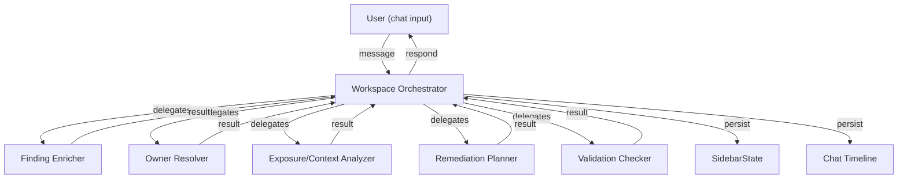

# Agent Pipeline

OpenSec uses a primary orchestrator agent plus five specialized sub-agents to handle vulnerability remediation. See [ADR-0008](../adr/0008-sub-agent-architecture.md) for the rationale.

## Pipeline Overview



## Interaction Pattern

Every workspace interaction follows:

**ask -> run -> summarize -> persist -> decide next**

1. User asks a question or triggers an action
2. Orchestrator decides which sub-agent (if any) to run
3. Sub-agent executes and returns structured output
4. Orchestrator summarizes the result in chat and updates SidebarState
5. Orchestrator suggests the next action to the user

## Common Output Contract

Every sub-agent returns:

```json
{
  "summary": "One-sentence plain text summary",
  "result_card_markdown": "## Title\n\nDetailed markdown result card...",
  "structured_output": { ... },
  "confidence": 0.92,
  "evidence_sources": ["CMDB", "git log"],
  "suggested_next_action": "confirm_owner"
}
```

The orchestrator uses this to:
- Display the result card in the chat timeline
- Update the relevant SidebarState section
- Suggest the next action to the user

---

## Sub-Agent Specifications

### 1. Finding Enricher

**Purpose:** Normalize and enrich raw finding data with CVE details, severity context, and known exploit information.

**Input:**
- Raw finding payload from FindingSource adapter
- Optional user question (e.g., "Is there a known exploit?")

**Output — structured_output:**
```json
{
  "normalized_title": "...",
  "cve_ids": ["CVE-2026-XXXX"],
  "cvss_score": 9.1,
  "cvss_vector": "...",
  "description": "...",
  "affected_versions": "< 2.3.1",
  "fixed_version": "2.3.1",
  "known_exploits": true,
  "exploit_details": "...",
  "references": ["https://..."]
}
```

**SidebarState updates:** `summary`, `evidence`

---

### 2. Owner Resolver

**Purpose:** Identify the team or person responsible for remediating this finding.

**Input:**
- Finding (asset identifiers, file paths, package name)
- AssetContext from OwnershipContext adapter

**Output — structured_output:**
```json
{
  "candidates": [
    {
      "team": "Web Platform",
      "person": "alice@example.com",
      "confidence": 0.92,
      "evidence": "CMDB support group matches, 3/5 recent commits from this team",
      "source": "CMDB + git log"
    }
  ],
  "recommended_owner": "Web Platform",
  "reasoning": "..."
}
```

**SidebarState updates:** `owner`

---

### 3. Exposure/Context Analyzer

**Purpose:** Assess whether the vulnerability is actually reachable and what the blast radius looks like.

**Input:**
- Finding details
- AssetContext (environment, internet exposure, criticality)
- Code analysis context from OpenCode

**Output — structured_output:**
```json
{
  "environment": "production",
  "internet_facing": true,
  "reachable": "likely",
  "reachability_evidence": "Import chain: main.py -> auth.py -> vulnerable_lib",
  "business_criticality": "high",
  "blast_radius": "User authentication flow",
  "recommended_urgency": "immediate"
}
```

**SidebarState updates:** `evidence`, `summary`

---

### 4. Remediation Planner

**Purpose:** Generate a concrete fix plan with steps, interim mitigations, and definition of done.

**Input:**
- Enriched finding
- Owner info
- Exposure context
- User constraints (e.g., "we can't upgrade until next sprint")

**Output — structured_output:**
```json
{
  "plan_steps": [
    "Upgrade package-x from 2.1.0 to 2.3.1",
    "Run existing test suite to verify no regressions",
    "Deploy to staging, verify fix with scanner"
  ],
  "interim_mitigation": "Add WAF rule to block known exploit payload",
  "dependencies": ["Requires CI pipeline access"],
  "estimated_effort": "small",
  "suggested_due_date": "2026-04-01",
  "definition_of_done": [
    "Package upgraded to >= 2.3.1",
    "Tests pass",
    "Scanner confirms finding resolved",
    "No new vulnerabilities introduced"
  ],
  "validation_method": "Re-run Tenable scan on affected asset"
}
```

**SidebarState updates:** `plan`, `definition_of_done`

---

### 5. Validation Checker

**Purpose:** Confirm whether the applied fix actually resolved the vulnerability.

**Input:**
- Original finding state
- Linked ticket status
- ValidationOutcome from Validation adapter

**Output — structured_output:**
```json
{
  "verdict": "fixed",
  "evidence": "Re-scan shows package-x at version 2.3.1, CVE-2026-XXXX no longer detected",
  "remaining_concerns": [],
  "recommendation": "close"
}
```

**SidebarState updates:** `validation`

---

## OpenCode Configuration

Each sub-agent maps to an OpenCode agent config (`.opencode/agents/<name>.md`):

```markdown
---
mode: subagent
description: <agent purpose>
model: <configurable, defaults to primary model>
---

<system prompt specific to this agent>
```

The Workspace Orchestrator is configured as a primary agent. Sub-agents are invoked via OpenCode's subagent delegation mechanism.

## Adding a New Sub-Agent

1. Define the input/output contract in this document
2. Create the OpenCode agent config in `.opencode/agents/`
3. Add the agent type to the `AgentRun.agent_type` enum
4. Register the agent in the orchestrator's dispatch table
5. Define which SidebarState sections it updates
6. Write tests with fixture data
