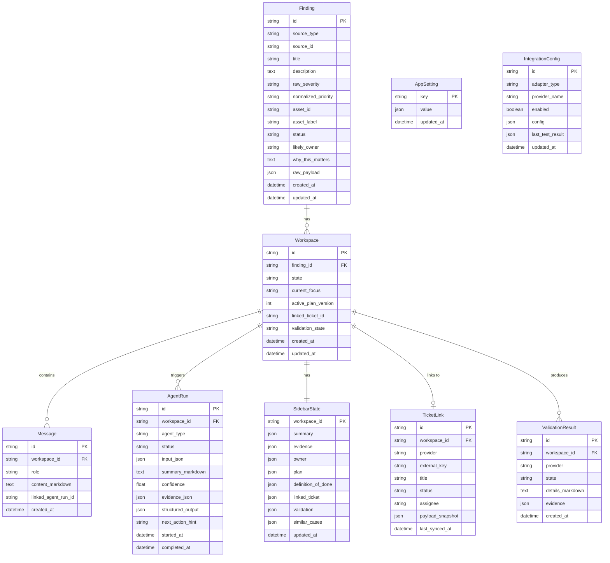

# Domain Model

## Entity Relationship Overview



## State Machines

### Finding Status

```
new --> triaged --> in_progress --> remediated --> validated --> closed
  \                                                              ^
   \--> exception (accepted risk) -------------------------------|
```

| State | Meaning |
|-------|---------|
| `new` | Just imported from scanner, not yet reviewed |
| `triaged` | Reviewed, priority set, ready to work on |
| `in_progress` | Active remediation workspace open |
| `remediated` | Fix applied, awaiting validation |
| `validated` | Validation confirms fix works |
| `closed` | Done — finding resolved or risk accepted |
| `exception` | Risk accepted, documented, not fixing |

### Workspace State

```
open --> waiting --> ready_to_close --> closed
  ^                                      |
  |---------- reopened <-----------------|
```

| State | Meaning |
|-------|---------|
| `open` | Active work in progress |
| `waiting` | Blocked on external action (e.g., ticket assignee) |
| `ready_to_close` | Validation passed, ready for final review |
| `closed` | Work complete |
| `reopened` | Validation failed or new information surfaced |

### AgentRun Status

```
queued --> running --> completed
                  \-> failed
                  \-> cancelled
```

### ValidationResult State

```
not_started --> pending --> fixed
                       \-> still_active
                       \-> uncertain
```

## Key Design Rules

1. **SidebarState is always the latest truth.** After every agent run that produces relevant output, the orchestrator updates SidebarState. The UI reads SidebarState to render the sidebar, not individual agent runs.

2. **Agent output must never live only in chat.** Every meaningful agent result is persisted both as a Message (for the chat timeline) and as a SidebarState update (for structured context).

3. **Findings and Workspaces are 1:1 for MVP.** One Finding maps to one Workspace. Group remediation (multiple findings in one workspace) is a future enhancement.

4. **All IDs are UUIDs.** Generated server-side. No auto-increment integers.

5. **Timestamps are UTC ISO 8601.** Stored as TEXT in SQLite for portability.
