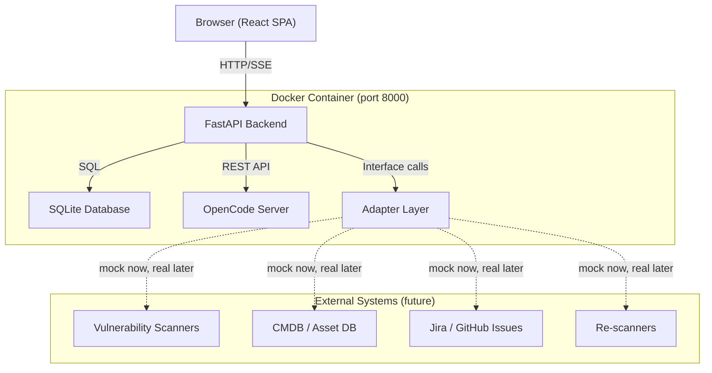

# System Architecture Overview

## High-Level Diagram



## Component Responsibilities

### Browser (React SPA)

Serves five pages — see [ADR-0003](../adr/0003-react-vite-tailwind-frontend.md).

| Page | Purpose |
|------|---------|
| Queue | List, filter, sort vulnerability findings. Entry point for remediation. |
| Workspace | Chat-led remediation session with persistent sidebar, agent run cards, and actions. |
| History | Browse completed workspaces. Replay chats, view outcomes. |
| Integrations | Configure adapter connections (finding sources, ticketing, etc.). |
| Settings | Model/provider config, agent settings, app preferences. |

### FastAPI Backend

The product brain — see [ADR-0002](../adr/0002-fastapi-backend.md).

- **API layer:** REST endpoints for findings, workspaces, messages, agent runs, settings
- **Orchestrator:** Manages the agent pipeline — decides which sub-agent to run, passes context, persists results
- **OpenCode bridge:** Starts and communicates with the OpenCode server subprocess
- **Adapter broker:** Routes adapter calls through the appropriate provider (mock or real)
- **Static file server:** Serves the built frontend in production

### OpenCode Server

The AI runtime engine — see [ADR-0001](../adr/0001-opencode-engine-integration.md).

- Runs on an internal-only port (default 4096)
- Handles LLM provider connections, model selection, and token management
- Executes agent prompts with configurable tools and permissions
- Streams responses via server-sent events
- Manages session state, memory, and compaction

### SQLite Database

Product state store — see [ADR-0004](../adr/0004-sqlite-persistence.md).

- Single file at `data/opensec.db`
- All domain entities (see [domain-model.md](domain-model.md))
- WAL mode for read concurrency
- Numbered migration scripts

### Adapter Layer

External system bridge — see [ADR-0006](../adr/0006-mock-first-adapters.md).

Four interface categories, each with a mock provider for MVP:

1. FindingSource
2. OwnershipContext
3. Ticketing
4. Validation

See [adapter-interfaces.md](adapter-interfaces.md) for full specs.

## Internal Communication

```
Browser  --HTTP/SSE-->  FastAPI (:8000)
                            |
                            +--SQL-->  SQLite (file)
                            |
                            +--HTTP-->  OpenCode (:4096, internal only)
                            |
                            +--call-->  Adapters (in-process)
```

- Browser never talks to OpenCode directly
- All agent interactions are proxied through FastAPI
- Adapter calls are in-process function calls (not HTTP) for MVP

## Deployment Model

Single Docker container — see [ADR-0005](../adr/0005-single-docker-container.md).

```
docker run -p 8000:8000 -v opensec-data:/data opensec
```

Internally managed by a process supervisor (supervisord):

1. FastAPI (uvicorn) — serves API + frontend
2. OpenCode server — AI engine subprocess
